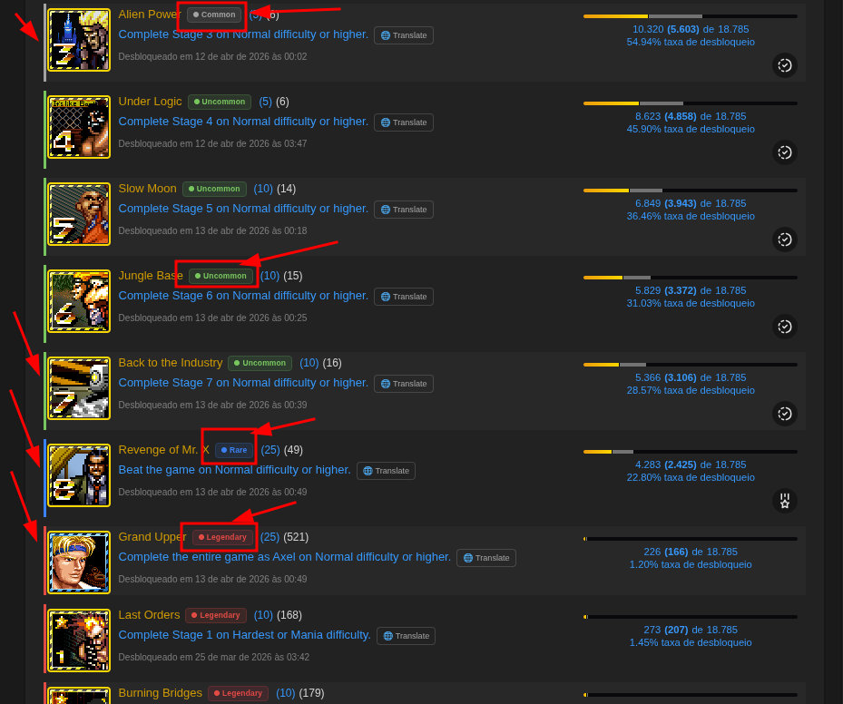
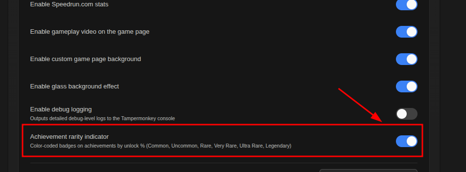

# 🏅 Achievement Rarity Indicator

> **Where:** Game pages (achievement list) and user profile pages (achievement badges)

## What it does

Adds color-coded rarity indicators to achievements based on their unlock percentage.

## On game pages

Each achievement card gets:
- A **colored left border** (3px) indicating rarity
- A **rarity label** badge after the title (e.g., "🔵 Rare")

## On profile pages

Achievement badge images in the paginated "Last Games Played" section get a **colored border** matching their rarity tier.

## Rarity tiers

| Unlock Rate | Label | Color | Emoji |
|:-----------:|-------|-------|:-----:|
| ≥ 50% | **Common** | Gray `#a3a3a3` | ⚪ |
| 25% – 49% | **Uncommon** | Green `#22c55e` | 🟢 |
| 10% – 24% | **Rare** | Blue `#3b82f6` | 🔵 |
| 5% – 9% | **Very Rare** | Purple `#a855f7` | 🟣 |
| 2% – 4% | **Ultra Rare** | Amber `#f59e0b` | 🟡 |
| < 2% | **Legendary** | Red `#ef4444` | 🔴 |

## Language support

The rarity indicator works on game pages in **any language** — it uses language-agnostic percentage parsing that handles both `.` and `,` decimal separators.

## Toggle

Enable or disable in **[Settings](Settings-Panel) → Achievement rarity indicator**.

