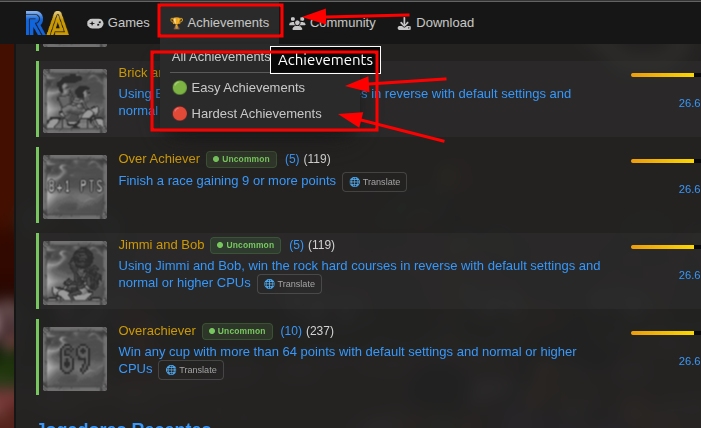

# 🎮 Achievements Dropdown Menu

> **Where:** Site navigation bar (header), on every page

## What it does

Adds an **"Achievements"** dropdown menu to the header navigation, next to the "Games" dropdown. This restores a navigation option that was removed in a previous RA site update.

## Menu items

| Item | Link | Description |
|------|------|-------------|
| **All Achievements** | `/achievementList.php` | Browse all achievements |
| **🟢 Easy Achievements** | `/achievementList.php?s=4&p=2` | Achievements sorted by most unlocked |
| **🔴 Hardest Achievements** | `/achievementList.php?s=14&p=2` | Achievements sorted by fewest unlocked |

## How it looks

The dropdown is styled to match the native RA navigation dropdowns, so it blends seamlessly with the site's header.
