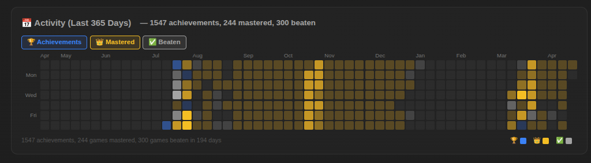
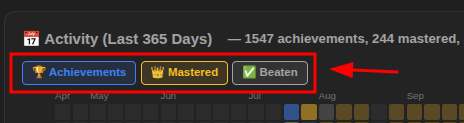
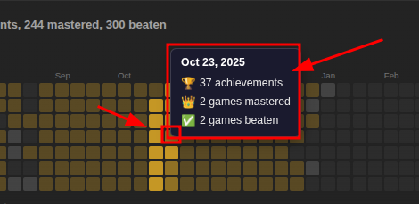
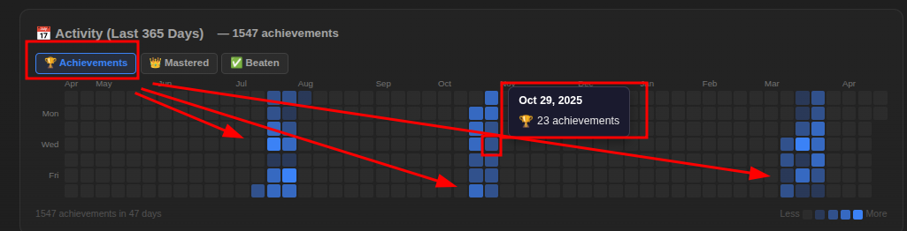
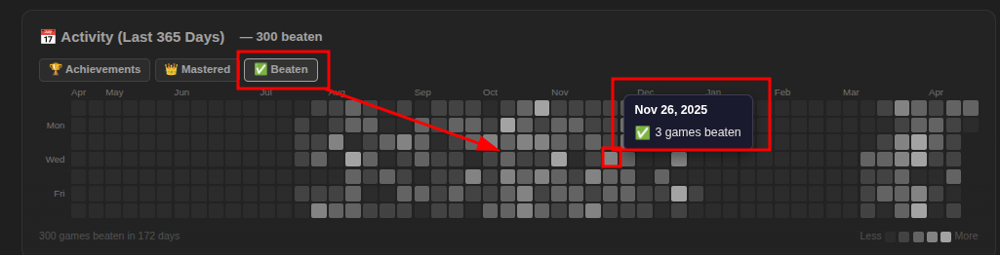
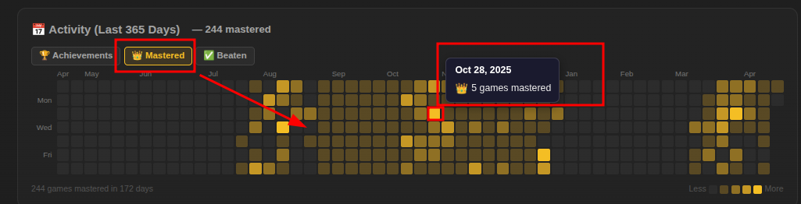
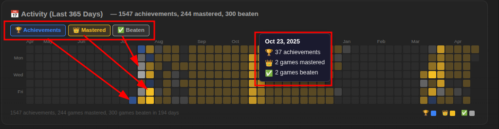
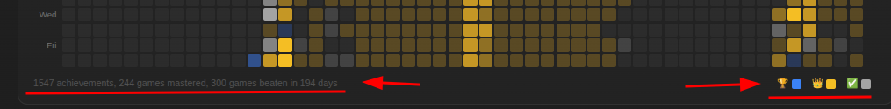

# 📅 Activity Timeline

> **Where:** Inside the Player Insights Dashboard (first section), on user profile pages
>
> **Requires:** [RA API Key](Getting-Started#step-3--set-up-your-api-key)

## What it is

A **GitHub-style contribution heatmap** showing activity over the past **365 days** (52 weeks × 7 days), with month labels and day-of-week indicators.



## How to read it

- Each small square represents **one day**
- **Darker color = more activity** that day (5 intensity levels: empty → level 4)
- Rows = days of the week (Mon–Sun)
- Columns = weeks

## Toggle modes (multi-select)

Three toggle buttons above the heatmap:



| Button | Color | What it tracks |
|--------|-------|---------------|
| **🏆 Achievements** | Blue shades | Achievements earned per day |
| **👑 Mastered** | Gold shades | Games mastered per day |
| **✅ Beaten** | Gray shades | Games beaten per day |

### How multi-select works

- **All three are active by default**
- Click any button to toggle it on/off
- **At least one must remain active**

## Tooltip

Hover over any day square to see a detailed popup:



```
Mar 19, 2026
🏆 5 achievements
👑 1 mastered
✅ 2 beaten
```

The tooltip shows the full date (with year) and a breakdown per active mode with icons.

## Achievements Activity: 


## Beaten Activity:


## Mastered Activity:


## All Activity:


- When multiple modes are active, each day's square uses **priority coloring**:
  - **Mastered** (gold) > **Beaten** (gray) > **Achievements** (blue)
  - The highest-priority event type present on that day determines the cell color


## Footer



Below the heatmap:
- Total counts per active mode (e.g., "🏆 1,234 achievements · 👑 45 mastered · ✅ 78 beaten")
- Number of active days
- Color legend (single mode = color scale; multi mode = colored dots per mode)

## Data source

- **Achievements:** Fetched via `API_GetAchievementsEarnedBetween` in 4 quarterly chunks (bypasses the 500-record API limit)
- **Mastered/Beaten dates:** Fetched via `API_GetUserAwards`
