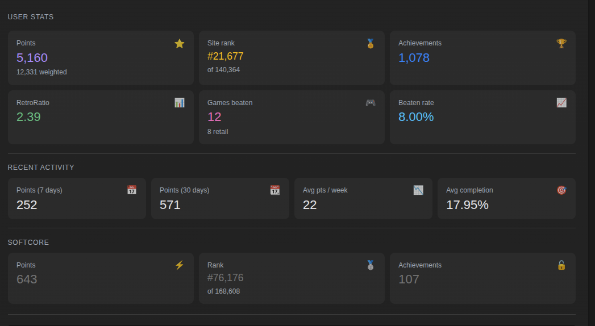
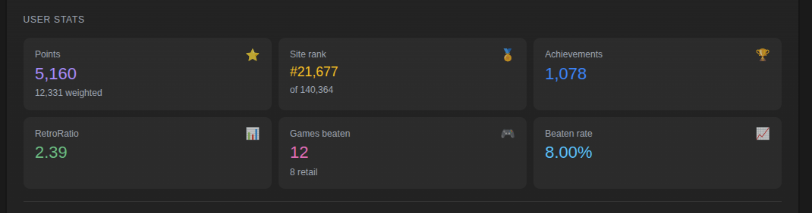
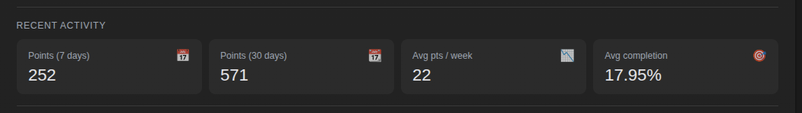
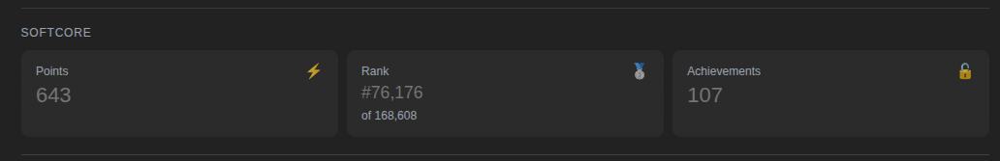

# 📈 Enhanced User Stats

> **Where:** Replaces the native "User Stats" section on user profile pages (`/user/{username}`)

## What it does

The native RA "User Stats" section is replaced with a modern card-style layout with icons and colors, divided into 3 areas.

## Primary Stats (6 metric cards)

Displayed in a 3-column grid:

| Card | Icon | Description |
|------|:----:|-------------|
| **Points** | 💎 | Total points earned (with weighted sub-value) |
| **Site Rank** | 🏅 | Current ranking (with "of X total" sub-value) |
| **Achievements** | 🏆 | Total achievements unlocked |
| **RetroRatio** | 📊 | Your retro ratio score |
| **Games Beaten** | 🎮 | Total games beaten (with retail sub-value) |
| **Beaten Rate** | 📈 | Percentage of started games that are beaten |

## Recent Activity (4 cards)

Only shown if the player has recent activity data:

| Card | Description |
|------|-------------|
| **Points (7 days)** | Points earned in the last week |
| **Points (30 days)** | Points earned in the last month |
| **Avg pts/week** | Average points earned per week |
| **Avg completion** | Average completion percentage across games |

## Softcore Stats (3 cards)

Only shown if the player has softcore activity. Uses dimmer styling:

| Card | Description |
|------|-------------|
| **Points** | Softcore points |
| **Rank** | Softcore rank |
| **Achievements** | Softcore achievements |

## Data source

All data is scraped from the native RA User Stats DOM (no extra API calls needed).
