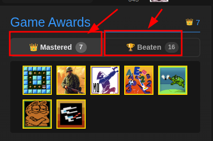
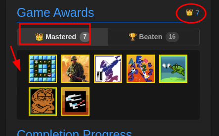
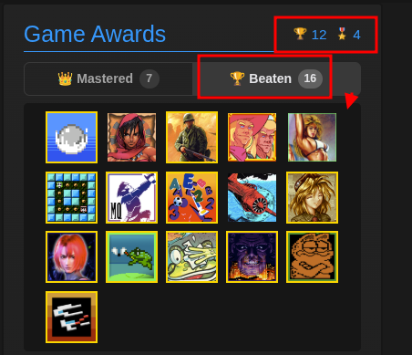

# 🏆 Game Awards — Mastered & Beaten Tabs

> **Where:** User profile sidebar, inside the "Game Awards" section (`#gameawards`)
>
> **Requires:** [RA API Key](Getting-Started#step-3--set-up-your-api-key) for the Beaten tab

## What it does

Adds two tabs above the native Game Awards badge grid, letting you switch between mastered and beaten game views.

## Tabs

- **Hardcore** beaten badges are shown in **gold** styling
- **Casual** (formerly "softcore") beaten badges are slightly **dimmed**
- Hover over any badge to see the game info tooltip (uses the native RA tooltip system)
- The section heading icon and counter update when switching tabs to reflect beaten HC/SC counts

| Tab | Description |
|-----|-------------|
| **👑 Mastered** (default) | Shows the native mastered/completed badge grid (unchanged) |
| **🏆 Beaten** | Shows all beaten games fetched from the API |

## How to use

1. Go to any user profile
2. In the sidebar, find the **Game Awards** section
3. Click the tabs to switch between **Mastered** and **Beaten** views

## Mastered tab details

- **Hardcore** beaten badges are shown in **gold** styling
- **Casual** beaten badges are slightly **dimmed**

## Beaten tab details

- **Hardcore** beaten badges are shown in **gold** styling
- **Casual** beaten badges are slightly **dimmed**
- Hover over any badge to see the game info tooltip (uses the native RA tooltip system)
- The section heading icon and counter update when switching tabs to reflect beaten HC/SC counts

## Data source

- **Mastered tab:** Native DOM content (no API call)
- **Beaten tab:** Fetched from `API_GetUserAwards` endpoint

## Troubleshooting

If the **Beaten** tab shows *"Failed to load beaten games"*, update to **v2.9.0
or newer** — earlier versions built the badge tooltips with an attribute name
the browser rejects, which aborted the render.
