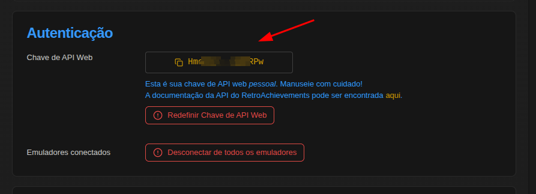
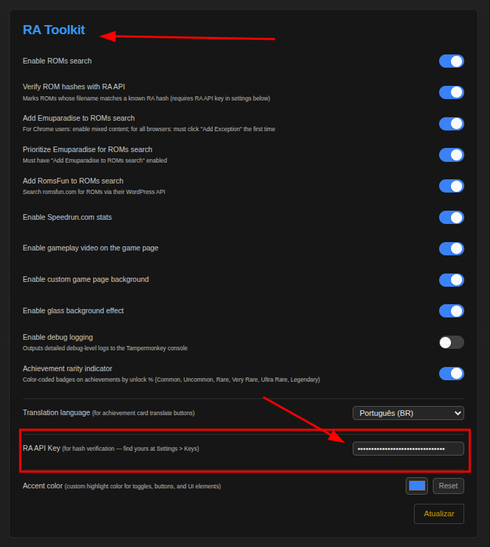

# 🚀 Getting Started

## Step 1 — Install Tampermonkey

Tampermonkey is a browser extension that lets you run userscripts on any website.

| Browser | Link |
|---------|------|
| Chrome  | [Chrome Web Store](https://chrome.google.com/webstore/detail/tampermonkey/dhdgffkkebhmkfjojejmpbldmpobfkfo) |
| Firefox | [Firefox Add-ons](https://addons.mozilla.org/firefox/addon/tampermonkey/) |
| Edge    | [Edge Add-ons](https://microsoftedge.microsoft.com/addons/detail/tampermonkey/iikmkjmpaadaobahmlepeloendndfphd) |
| Safari  | [Mac App Store](https://apps.apple.com/app/tampermonkey/id1482490089) |
| Opera   | [Opera Add-ons](https://addons.opera.com/extensions/details/tampermonkey-beta/) |

1. Click the link for your browser above
2. Click **Add to browser** / **Install**
3. Confirm the installation when prompted
4. You should see the Tampermonkey icon in your browser toolbar

## Step 2 — Install RA Toolkit

**Option A — One click (recommended):**

👉 **[Click here to install RA Toolkit](https://update.greasyfork.org/scripts/570282/RA%20Toolkit.user.js)**

Tampermonkey will detect the `.user.js` file and show an install screen. Click **Install**.

**Option B — Manual install:**

1. Copy the script URL:
   ```
   https://update.greasyfork.org/scripts/570282/RA%20Toolkit.user.js
   ```
2. Click the Tampermonkey icon → **Create a new script**
3. Delete the default template content
4. Open the URL above in a new tab, select all (`Ctrl+A`), copy (`Ctrl+C`)
5. Paste into the editor (`Ctrl+V`) → **File → Save** (`Ctrl+S`)

## Step 3 — Set up your API key

Many features require a **RetroAchievements Web API key**. Without it, features like the Dashboard, Timeline, and Pagination (page 2+) won't work.

### How to get your API key

1. Log in to [retroachievements.org](https://retroachievements.org)
2. Go to **Settings → Keys** (or visit `retroachievements.org/settings`)
3. Copy your **Web API Key**



### How to paste it in RA Toolkit

4. On the same Settings page, scroll down to the **RA Toolkit** card
5. Paste the key in the **"RA API Key"** field
6. Click **"Atualizar"** (Save) — the page will reload




### Which features need the API key?

| Feature | Needs API Key? |
|---------|:-:|
| ROM Search | No* |
| ROM Hash Verification (🏆 badge) | ✅ Yes |
| Player Insights Dashboard | ✅ Yes |
| Activity Timeline | ✅ Yes |
| Profile Pagination (page 2+) | ✅ Yes |
| Game Awards (Beaten tab) | ✅ Yes |
| Translation | No |
| Speedrun.com stats | No |
| Rarity Indicator | No |
| Wall Enhancements | No |
| Most Mastered tab | No |
| Achievements dropdown | No |

## Step 4 — Enjoy!

1. Visit [retroachievements.org](https://retroachievements.org)
2. Navigate to any game page to see ROM search, translations, rarity indicators, and more
3. Visit any user profile (`/user/{username}`) to see the Dashboard, Timeline, and Stats
4. Go to `/games` to see the Most Mastered tab

> **Auto-update:** The script updates automatically via Tampermonkey. To check manually: Tampermonkey icon → **Utilities** → **Check for userscript updates**.
