# 📊 Player Insights Dashboard

> **Where:** User profile pages (`/user/{username}`), above "Last Games Played"
>
> **Requires:** [RA API Key](Getting-Started#step-3--set-up-your-api-key)

## Modules

## Overview

The Player Insights Dashboard is injected on every user profile page. It provides detailed analytics about the player's gaming activity, streaks, rarest achievements, and progress.

### User Stats:

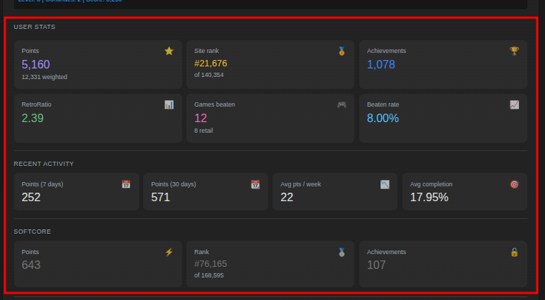

### Progression Status:

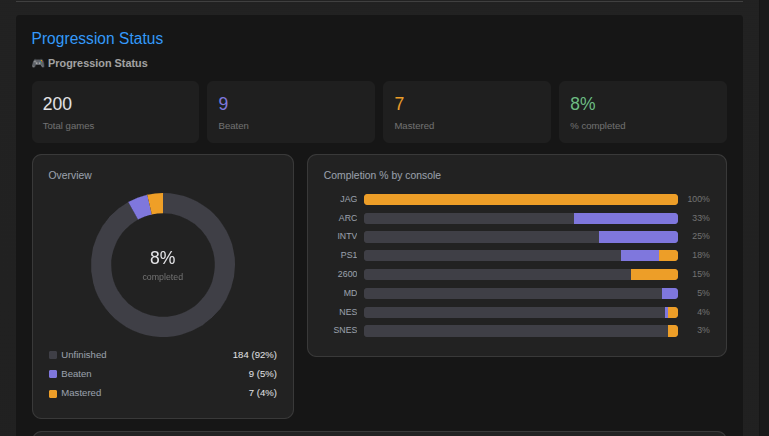

## Games by console

### Animated Bubbles:

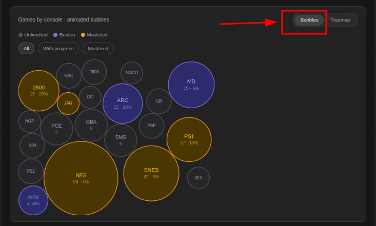

### Proportional Size:

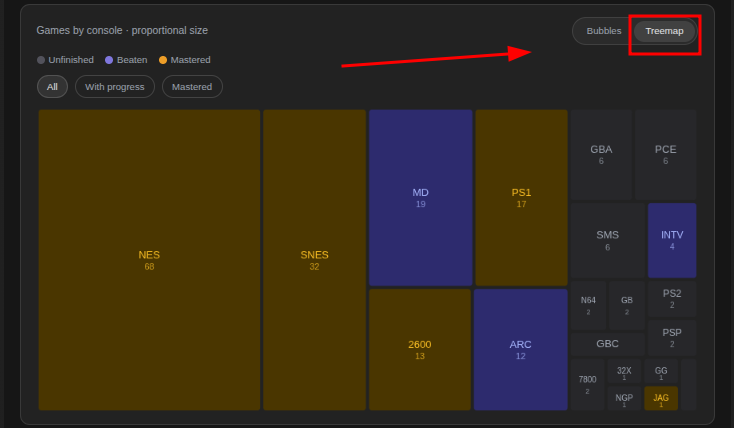

### Mastered vs Beaten · consoles with progress:

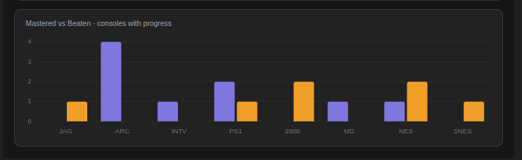

##  Activity Timeline (Last 365 Days) 📅

A full GitHub-style heatmap. See the [[Activity Timeline]] page for details.

### 1. All Activity: 

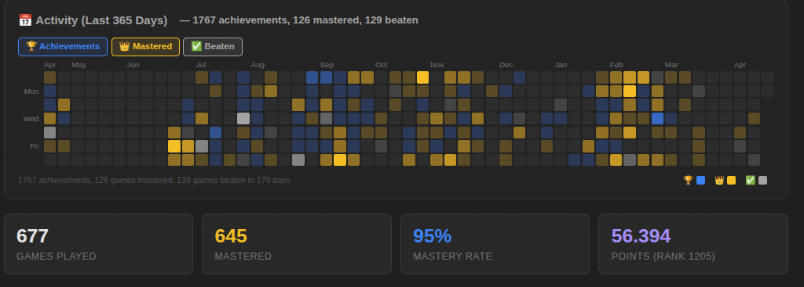

### 2. Achievements Activity: 

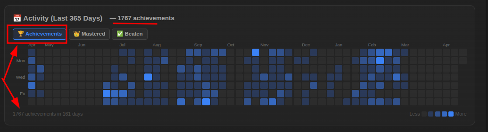

### 3. Mastered Activity: 

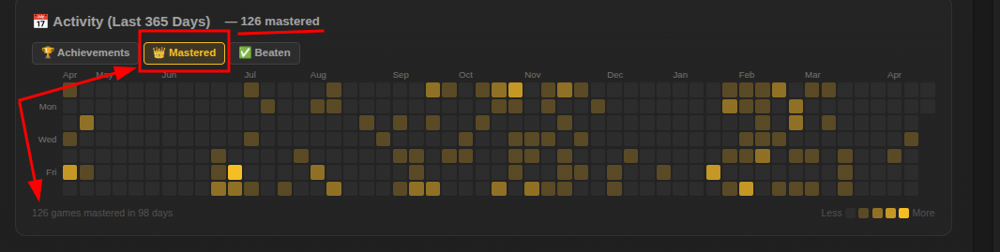

### 4. Beaten Activity: 

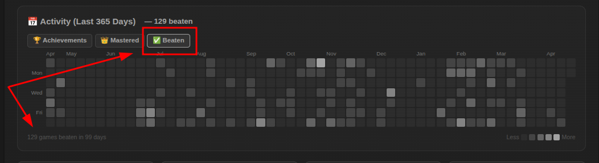

###  Stats Cards (4 cards in a row)

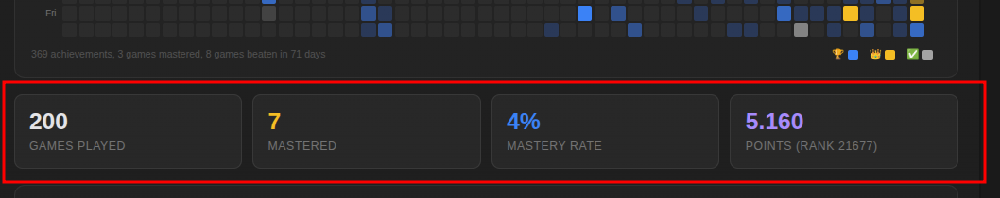

| Card | Description |
|------|-------------|
| **Games Played** | Total number of games the player has started |
| **Mastered** | Number of games with 100% completion (gold highlight) |
| **Mastery Rate** | Percentage of played games that are mastered (blue) |
| **Points & Rank** | Total points earned and site ranking (purple) |

### Almost There 🎯

Shows up to **5 games closest to 100% completion** (must be ≥50% done).

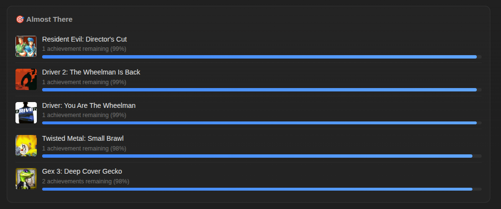

Each entry shows:
- Game icon and title (clickable link to the game page)
- Number of remaining achievements
- Current completion percentage
- Visual progress bar

> **Tip:** Use this to find which games you're closest to mastering!

### Streak Tracker 🔥

Tracks daily achievement-earning consistency over the past **365 days**:

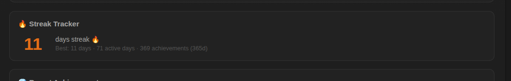

| Metric | Description |
|--------|-------------|
| **Current Streak** | How many consecutive days you've earned at least one achievement |
| **Best Streak** | Longest consecutive streak in the past year |
| **Active Days** | Total number of days with at least one achievement |
| **Total Achievements** | Sum of all achievements earned (365 days) |

### Rarest Achievements 💎

Your **top 5 rarest achievements** (sorted by TrueRatio, descending):

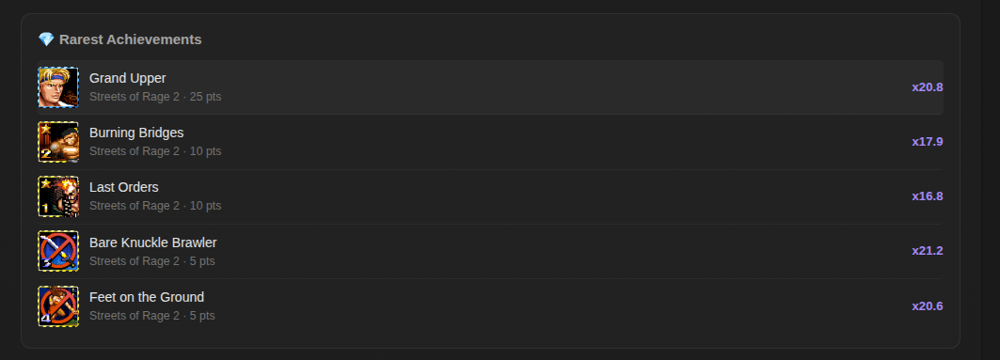

- Achievement badge image
- Title (clickable link to `/achievement/{id}`)
- Game name
- Points earned
- Rarity multiplier (e.g., "×3.5" = 3.5× more valuable than a common achievement)

## Loading state

While data is being fetched from the API, each section shows animated skeleton placeholders with a pulse animation.
