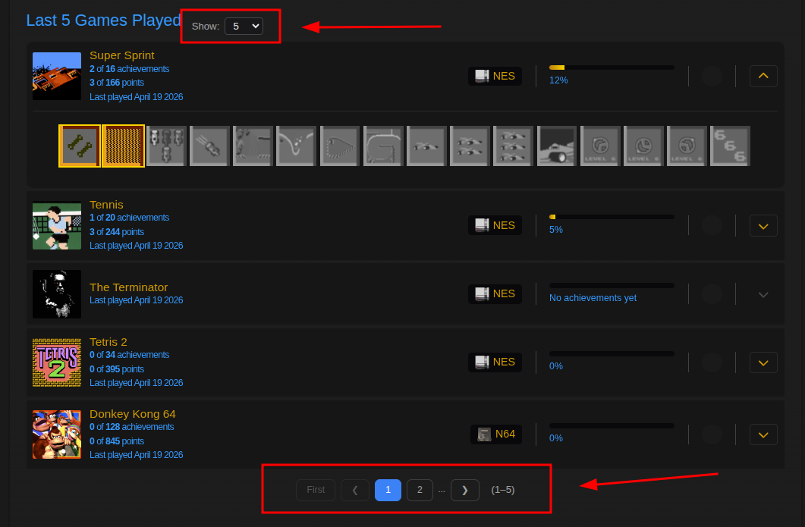
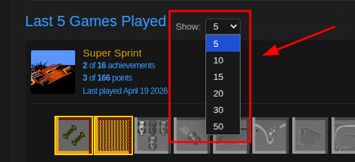
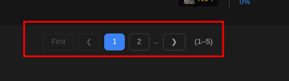
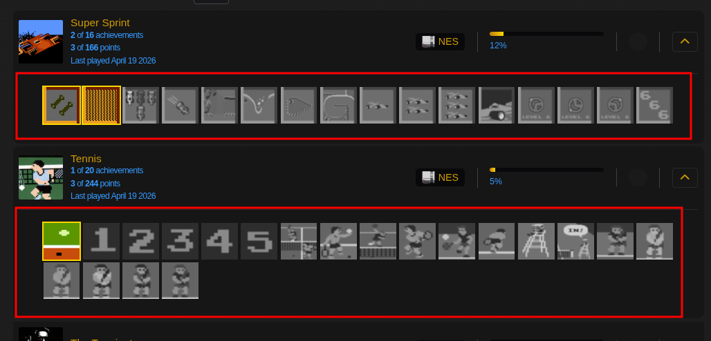
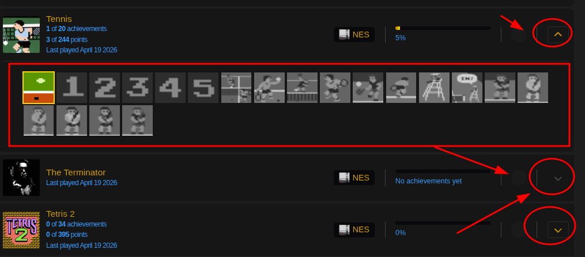

# 📄 Profile Pagination (Last Games Played)

> **Where:** User profile pages (`/user/{username}`), "Last Games Played" section
>
> **Requires:** [RA API Key](Getting-Started#step-3--set-up-your-api-key) for pages beyond page 1

## What it does

Replaces the limited "Last X Games Played" list with a fully paginated view, allowing you to browse through all of a player's recently played games.

## Controls

### Per-page selector

A dropdown next to the section heading lets you choose how many games to show per page:
- **5** / **10** / **15** / **20** / **30** / **50** items

### Pagination bar

Below the games list:

- **First** — go to the first page
- **‹ Prev** — go to the previous page
- **1 2 3 ...** — numbered page buttons (up to 5 visible)
- **Next ›** — go to the next page
- **Last** — go to the last page
- Page range info (e.g., "6–10 of 47")

## Game cards

Each game card displays:

| Element | Description |
|---------|-------------|
| **Game icon** | 58×58px, clickable link to the game page |
| **Title** | Game name |
| **Achievement count** | e.g., "5 of 20" |
| **Points** | Points earned in this game |
| **Console badge** | Icon + short name (e.g., "SNES", "PS1") |
| **Last played** | Date of last activity |
| **Progress bar** | Hardcore % (solid) + casual % (lighter) |
| **Award label** | Mastered ✨, Completed, Beaten 🏆, or Beaten (casual) — with award date |

## Expanding achievements

Click the **chevron (▶)** on any game card to expand and see all individual achievement badges:

- Each badge has a **colored border** indicating its [[rarity tier|Achievement-Rarity]]
- **Unlocked** achievements are shown in full color
- **Locked** achievements are dimmed
- Badges are loaded on-demand from the API

## Loading state

While a new page is loading, animated skeleton cards with pulse animation serve as placeholders.
