# 🎨 Progression Status Dashboard

> **Where:** Replaces the native "Progression Status" section on user profile pages (`/user/{username}`)

## What it does

The native Progression Status section is hidden and replaced with a modern dark-themed dashboard featuring charts and interactive visualizations.

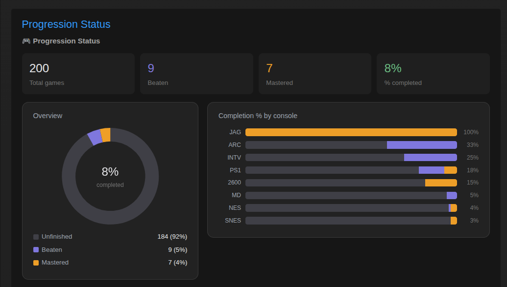

## Sections

### 1. KPI Grid (4 summary cards)

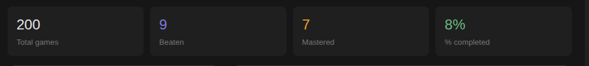

| Card | Accent | Description |
|------|--------|-------------|
| **Total Games** | Default | Number of games with any progress |
| **Beaten** | Purple | Total games beaten |
| **Mastered** | Gold | Total games mastered |
| **% Completed** | Green | Overall completion rate |

### 2. Overview Donut Chart (left column)

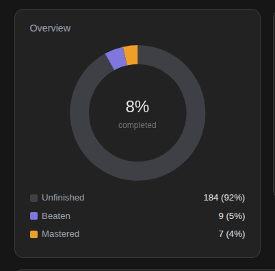

A Chart.js donut chart showing the split between:
- **Unfinished** games
- **Beaten** games
- **Mastered** games

The center of the donut shows the overall completion percentage. A legend is displayed below.

### 3. Completion by Console (right column)

Horizontal stacked bars showing the completion % for up to **12 consoles**, sorted by completion rate. Each bar shows beaten vs mastered proportions.

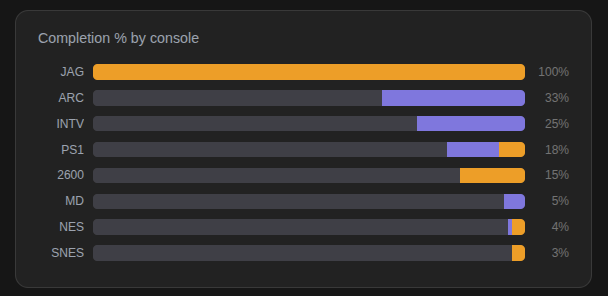

### 4. Interactive Visualization

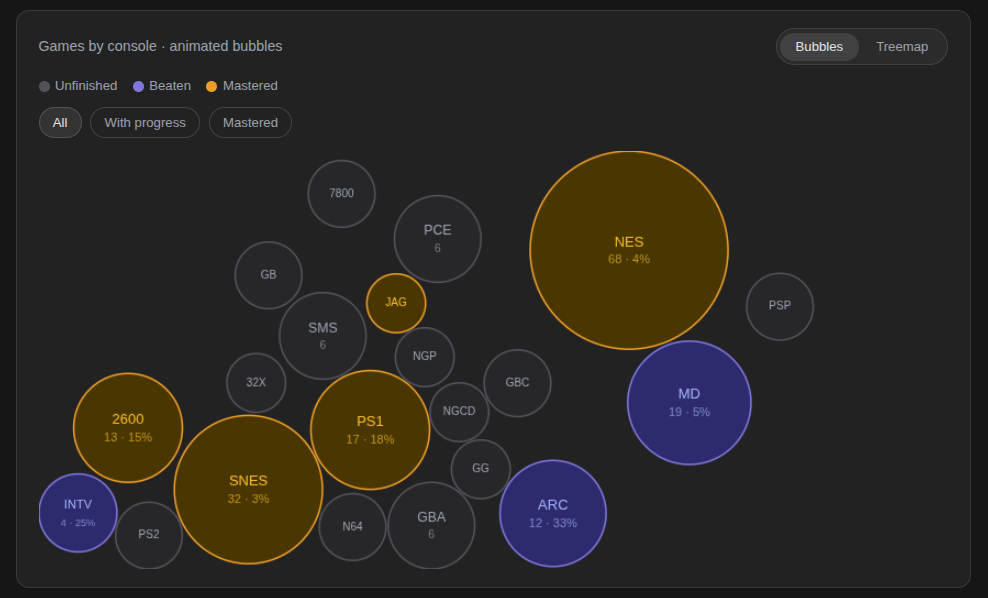

Two view modes (toggle buttons):

| Mode | Description |
|------|-------------|
| **Bubbles** | Animated bouncing circles sized by game count per console, colored by status. Physics simulation with collision detection. |
| **Treemap** | Proportional rectangles (squarified algorithm) showing console distribution |

- Bubbles filter:

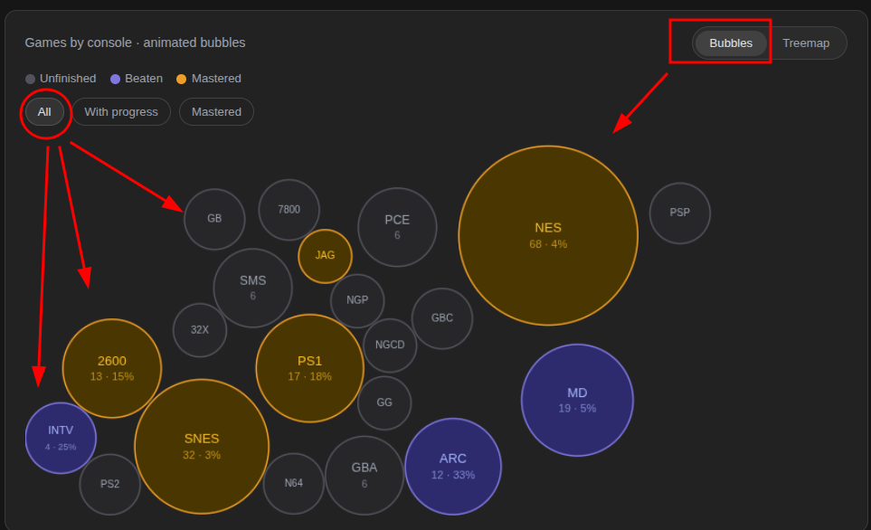

- Treemap filter: 

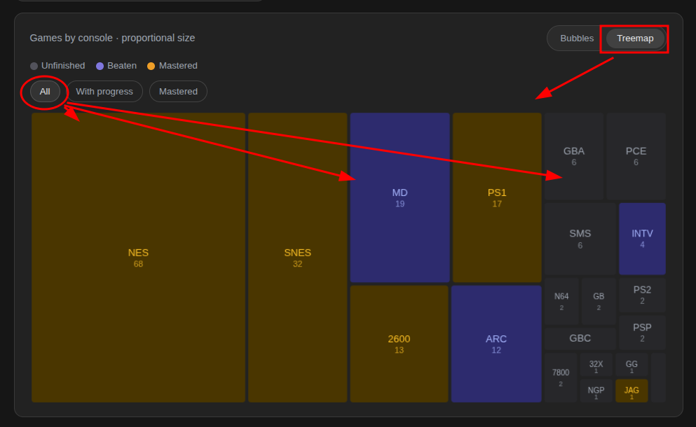

Three filter options:
- **All** — Show all consoles
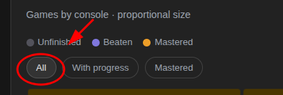

- **With Progress** — Only consoles where you have progress
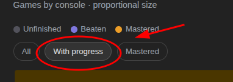

- **Mastered** — Only consoles with mastered games
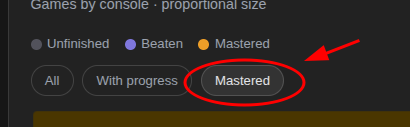

Hover over any bubble or rectangle to see a tooltip with:

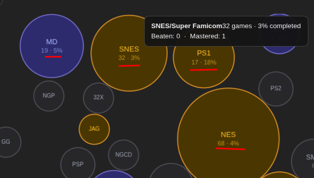

- Console name
- Game count
- Completion %
- Beaten/mastered counts

### 5. Mastered vs Beaten Bar Chart

A Chart.js grouped bar chart comparing mastered vs beaten counts for your **top 8 consoles** (sorted by total progress).

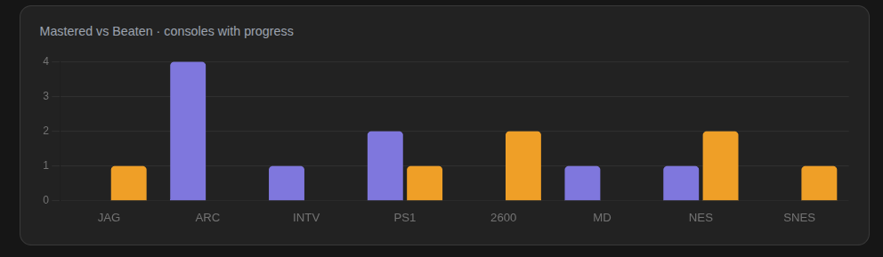

## Data source

All data is scraped from the native Progression Status rows in the DOM — no extra API calls.
