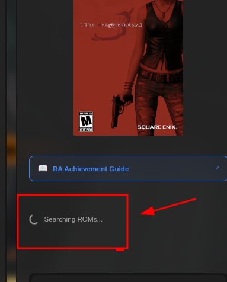
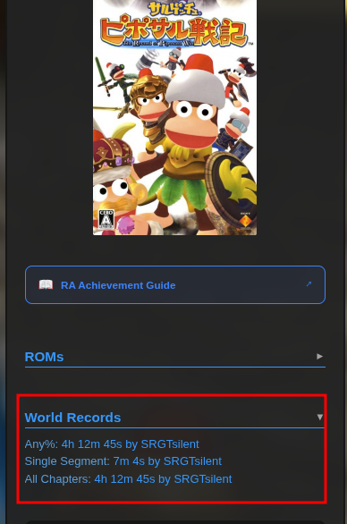
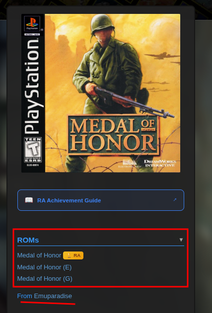
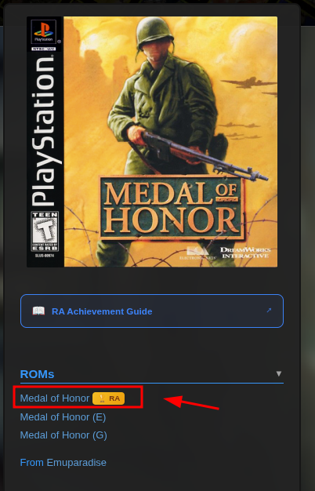
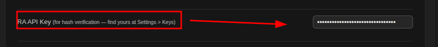
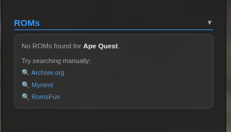
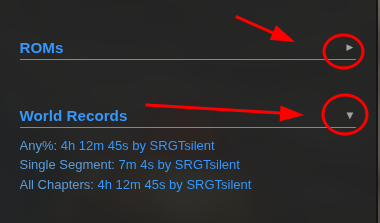

# 🔍 ROM Search

> **Where:** Sidebar of any game page (`/game/{id}`)
>
> **API Key:** Not required (except for hash verification)

## How it works

1. Navigate to any game page (e.g., `retroachievements.org/game/1`)
2. In the sidebar (right side), look for the **"ROMs"** section below the box art
3. The script automatically searches for matching ROMs across multiple sources
4. Results appear as a list of downloadable links

## What you'll see

### World Records session 

### ROM links
Each result shows the filename and source. Click to download.

### 🏆 RA Trophy Badge
A gold trophy icon means the ROM's hash matches the official RA database — **verified compatible** with RetroAchievements.

> Hover over the badge to see the MD5 hash, labels, and compatibility details.

**Requires:** RA API Key enabled in [Settings](Settings-Panel).

### No results
If nothing is found, manual search links to Archive.org, Myrient, and RomsFun are shown.

### PSP DLCs
For PSP games, DLCs are listed in a separate section.

## Search sources

ROMs are searched in this priority order:

| # | Source | Notes |
|---|--------|-------|
| 1 | **Cache** | Previously found results, cached for 24 hours |
| 2 | **Myrient** | Primary source for most consoles |
| 3 | **Archive.org** | No-Intro 2016 collection (fallback) |
| 4 | **Emuparadise** | Optional — enable in [Settings](Settings-Panel) |
| 5 | **RomsFun** | Optional — enabled by default |

For Arcade games, a specialized search using FBNeo DAT files is used.

## Title matching

The script uses smart title matching:
- Normalizes titles (strips articles like "The", punctuation, region tags)
- Tries exact match first, then falls back to substring matching
- Region-aware comparison

## Supported consoles

50+ systems including:

NES, SNES, Game Boy, GBC, GBA, N64, DS, DSi, GameCube, Wii, PS1, PS2, PSP, Genesis/Mega Drive, Master System, Game Gear, Saturn, Dreamcast, Sega CD, 32X, Atari 2600, Atari 7800, Atari Jaguar, Atari Lynx, PC Engine, PC-FX, Neo Geo CD, Neo Geo Pocket, WonderSwan, MSX, Vectrex, 3DO, ColecoVision, Virtual Boy, SG-1000, Apple II, Arduboy, Arcadia 2001, Fairchild, Magnavox Odyssey 2, Intellivision, VC 4000, Mega Duck, Watara, Zeebo, Amstrad CPC, Uzebox, WASM-4, Arcade

## Collapse/Expand

Click the **"ROMs"** heading to collapse or expand the section. The state is remembered across visits.

## Settings

| Setting | Default | Description |
|---------|:-------:|-------------|
| Enable ROMs search | ✅ On | Toggle the entire ROM search feature |
| Verify ROM hashes | ✅ On | Enable 🏆 badge (requires API key) |
| Add Emuparadise | ❌ Off | Include Emuparadise as a source |
| Prioritize Emuparadise | ❌ Off | Search Emuparadise first |
| Add RomsFun | ✅ On | Include RomsFun as a source |
