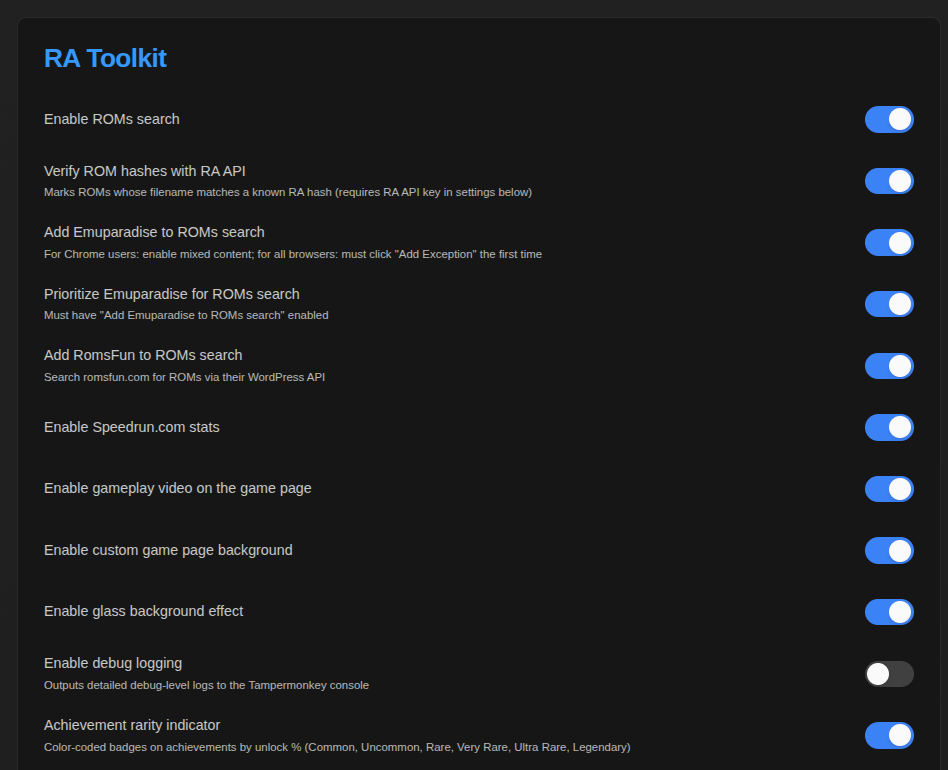
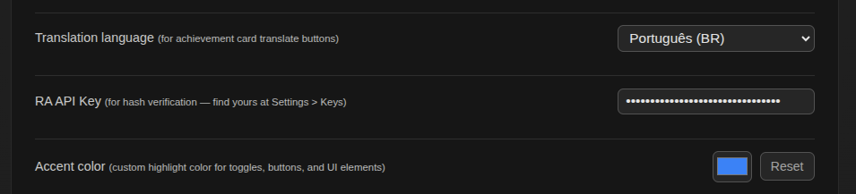
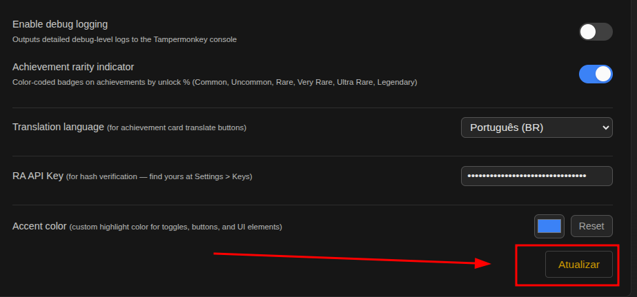

# ⚙️ Settings Panel

## How to open

1. Go to [retroachievements.org/settings](https://retroachievements.org/settings)
2. Scroll to the bottom of the page — you'll see a **"RA Toolkit"** card below the native settings cards

> **Since v2.9.0:** RetroAchievements split the settings page into tabs
> (*Profile*, *Notifications*, *Account*, *Applications*). The RA Toolkit card is
> pinned below whichever tab is open, so you can reach it from any of them.

## Toggles (on/off switches)

| Toggle | Default | What it does |
|--------|:-------:|-------------|
| **Enable ROMs search** | ✅ On | Shows ROM download links on game pages |
| **Verify ROM hashes with RA API** | ✅ On | Adds 🏆 badge to ROMs verified against RA hash database |
| **Add Emuparadise to ROMs search** | ❌ Off | Includes Emuparadise as a ROM source |
| **Prioritize Emuparadise** | ❌ Off | Searches Emuparadise first before other sources |
| **Add RomsFun to ROMs search** | ✅ On | Includes RomsFun as a ROM source |
| **Enable Speedrun.com stats** | ❌ Off | Shows World Records section on game pages |
| **Enable gameplay video** | ✅ On | Embeds speedrun video on game pages |
| **Enable custom game page background** | ✅ On | Adds blurred in-game screenshot as page background |
| **Enable glass background effect** | ✅ On | Semi-transparent glass effect on sidebar/article |
| **Achievement rarity indicator** | ✅ On | Color-coded rarity badges on achievements |
| **Enable debug logging** | ❌ Off | Verbose logging in Tampermonkey console (for troubleshooting) |

## Other controls

| Control | Default | What it does |
|---------|---------|-------------|
| **Translation language** (dropdown) | `pt-BR` | Choose from: Portuguese, Spanish, French, German, Italian, Japanese, Korean, Chinese, Russian, Arabic |
| **RA API Key** (password field) | — | Your RetroAchievements Web API key ([how to get it](Getting-Started#step-3--set-up-your-api-key)) |
| **Accent color** (color picker) | `#3b82f6` (blue) | Custom highlight color for buttons, badges, and accents |
| **Reset** (button) | — | Resets accent color to the default blue |

## Saving changes

Click the **"Atualizar"** button at the bottom of the card.

You'll see a **✓ Salvo!** confirmation, then the page reloads automatically after a short delay.
