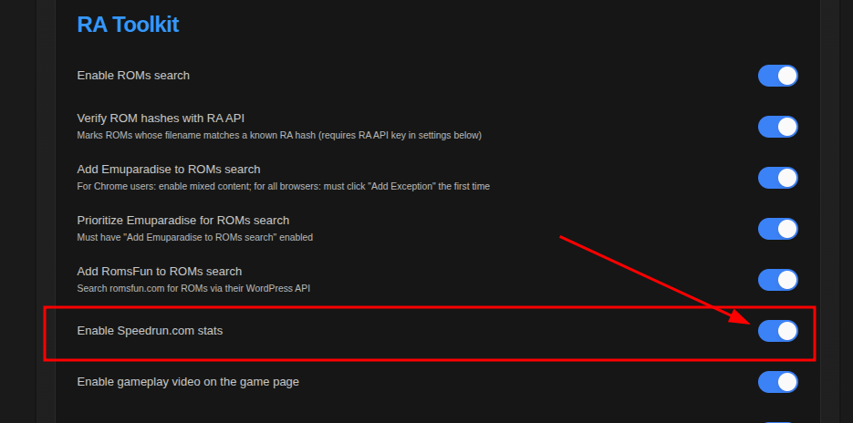
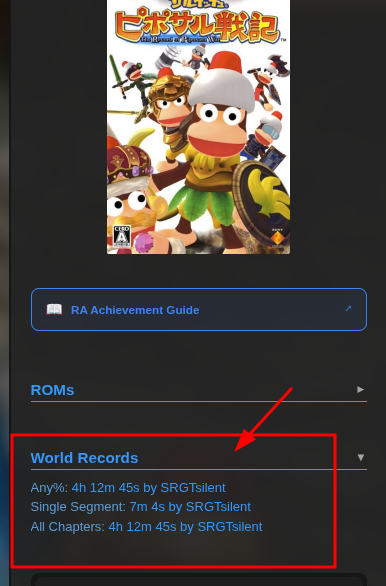
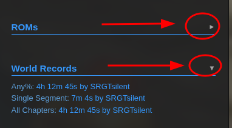
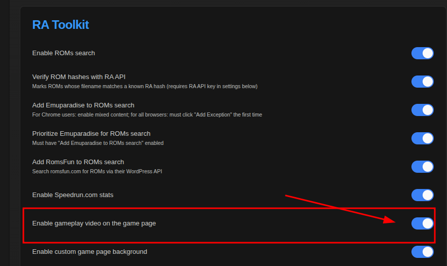
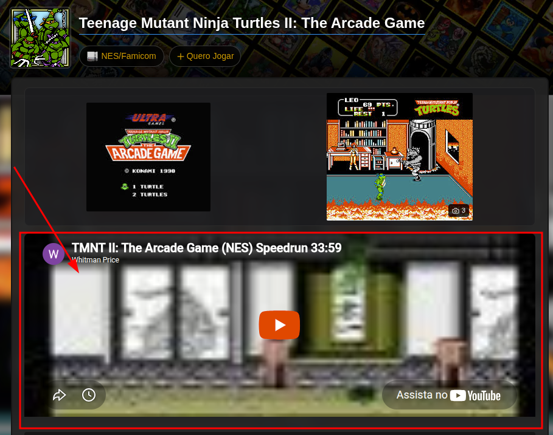

# 🎬 Speedrun.com Integration

> **Where:** Game page sidebar (World Records) and main article (video embed)
>
> **Requires:** Enabled in [Settings](Settings-Panel)

## How to enable

1. Go to **[Settings](Settings-Panel) → RA Toolkit**
2. Turn on **"Enable Speedrun.com stats"**
3. Optionally turn on **"Enable gameplay video on the game page"**
4. Click **"Atualizar"** to save

## World Records section

A **"World Records"** section appears in the game page sidebar showing:

| Column | Description |
|--------|-------------|
| **Category** | Speedrun category name (e.g., "Any%", "100%") |
| **Time** | Best verified time |
| **Runner** | Runner's name (linked to the run) |

Only categories with verified runs are shown.

### Collapse/Expand

Click the **"World Records"** heading to collapse or expand. State is persisted across visits.

## Gameplay video embed

If **"Enable gameplay video"** is also turned on:

- The first speedrun's video (YouTube or Twitch) is embedded as an iframe on the game page
- Appears in the main article area, below the screenshots section
- Width: 100%, Height: 315px

## Data source

Speedrun.com REST API v1:
1. Searches for the game by name + platform
2. Fetches categories
3. Gets verified runs per category
4. Resolves runner usernames
